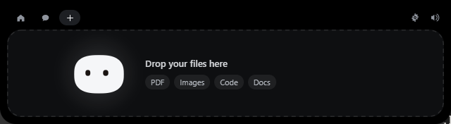
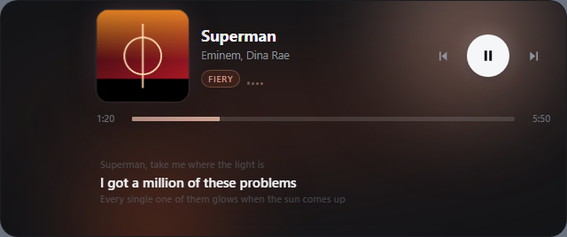
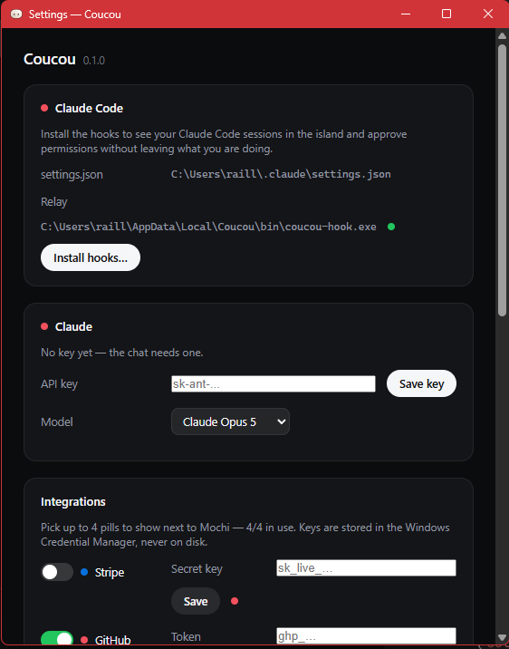

<div align="center">


# Coucou for Windows

**Mochi doesn't get a notch on a PC — so it lives at the top of your screen instead.**

Approve agent permissions, watch your sessions work, drop a file, chat with
Claude, keep an eye on your services, see what song is playing — without leaving
what you're doing. Works with Claude Code, OpenCode and Antigravity.


</div>


---

## Install

1. Download `Coucou-Windows-setup.exe` from the [releases page](../../releases).
2. Run it. It installs for the current user only — no admin prompt.
3. Coucou starts, waves hello, and then gets out of the way.

### "Windows protected your PC"

The installer isn't code-signed yet, so **SmartScreen** shows a blue warning the first
few times anybody downloads it:

> Windows protected your PC — Microsoft Defender SmartScreen prevented an unrecognised app from starting.

Click **More info**, then **Run anyway**. That's it. Signing is on the list; until
then this is what an unsigned installer looks like on Windows, and you can always
[build it yourself](#build-it-yourself) if you'd rather not trust a download.

## Using it




| What you do | What happens |
|---|---|
| Move the mouse to the very top-centre of the screen | Mochi peeks out |
| Click the small island | It opens |
| Click Mochi | It gets annoyed. Three times in a row and it goes dizzy |
| Rest the pointer on Mochi for two seconds | Hearts |
| Drag a file onto the island | Mochi turns into a box, swallows it, then offers to answer questions about it |
| `Ctrl`+`Alt`+`C` | Summon the island from anywhere |
| `Esc` | Closes the island |
| Tray icon | Open, Settings…, Pause, Quit |

Everything else happens on its own: a Claude Code permission request opens the
island with **Deny / Allow**, a finished session shows what it did, and
your integrations sit in the coloured pills next to Mochi.

## Clipboard and files

**Settings… → Clipboard & files.** Both are **off until you turn them on** — a
clipboard history that starts recording before anyone asked for one is a
surprise, not a feature.

Clipboard history keeps text *and* images, newest first, with pins, search and
one-click text transforms. It never records anything that looks like a
credential (best-effort — Windows won't say who copied something), and you choose
how long copies are kept or how many at most. Everything is local to
`%LOCALAPPDATA%\Coucou`.

The **file shelf** keeps dropped files for 30 days instead of the 7-day inbox, so
you can drag one back out into another app long after the folder you dropped it
from is gone. Copies only; your originals are never touched.

## Now playing



**Settings… → Now playing.** Brave — like every Chromium — publishes the playing
tab to Windows, so this needs no account, no keys and no network: title, artist,
album, play state, position and the transport buttons all come from the OS media
session. Anything your browser plays shows up.

- Real transport buttons. They drive the browser, not a private player.
- **Drag the timeline** to move the playhead, or use ← / → / Home / End.
- **Lyrics** from [lrclib.net](https://lrclib.net) — opt-in separately, because
  it is the only part that touches the network. Nothing is looked up while you
  are offline, and results are cached on the machine.
- An **optional Spotify link** adds per-song mood (which Mochi dances to) and
  fallback artwork. Tokens live in the Windows Credential Manager; the public
  client ID is yours to paste in.

The panel is lit by the album: `src/library/palette.ts` samples the cover and
tints the whole view in its colours. The collapsed bar carries the track title,
a progress hairline and a soft glow along its bottom edge — **Settings… → Album
glow on the bar** picks how it looks (`corner`, `wide`, `pulse`, `off`).

## Multi-agent review

When several harnesses are active, the island can list what each one is waiting
on and act on it from one place, instead of hunting through tabs.

## Claude Code



Open **Settings… → Claude Code → Install hooks…**. You get the exact diff of what
will change in `%USERPROFILE%\.claude\settings.json`, the path of the dated backup
that will be taken, and nothing is written until you click. Your own hooks are
never touched, and uninstalling removes only Coucou's entries.

The relay is a tiny executable, `coucou-hook.exe`, copied to
`%LOCALAPPDATA%\Coucou\bin\` at launch. It is given 300 ms to reach Coucou and
exits cleanly if the app is closed, slow or crashed — **a Claude Code session is
never blocked or slowed down by Coucou.** If nobody answers a permission request
in time, Coucou stays quiet and Claude Code asks in the terminal as usual.

It works from any terminal — Windows Terminal, PowerShell, VS Code, Git Bash.

## OpenCode

Open **Settings… → OpenCode → Install hooks…**. Coucou copies its `coucou.js`
plugin (with your relay path baked in) to
`%USERPROFILE%\.config\opencode\plugins\`, with the same dated-backup and
diff-preview flow as the Claude Code hooks. Nothing is written until you click.

The plugin forwards session, tool and permission events through
`coucou-hook.exe` to the island, where OpenCode gets its own pill. Approvals
work the same way: Allow / Deny in the island, TUI prompt when Coucou can't
answer. One thing to do yourself: OpenCode only raises permission prompts for
tools your policy marks `ask`, so island approvals need something like

```json
{ "$schema": "https://opencode.ai/config.json", "permission": { "*": "ask" } }
```

in `%USERPROFILE%\.config\opencode\opencode.json`. Explicit `deny` rules are
still enforced first. For a single project, copy the installed plugin to
`<project>\.opencode\plugins\coucou.js` instead of installing globally.

## Antigravity

Open **Settings… → Antigravity → Install hooks…**. Coucou merges its entries
under the `coucou` key into the global `%USERPROFILE%\.gemini\config\hooks.json`
(`PreToolUse` with a 120 s approval timeout, `PostToolUse`, `PreInvocation`
and `Stop` at 10 s) — dated backup, diff preview, nothing written until you
click. Antigravity gets its own pill in the island; tool calls that need a
human show the same Allow / Deny card, and fall back to Antigravity's own
prompt (respecting your Always Allow grants) when Coucou can't answer.

For a single project, merge the `coucou` key from
[`agents/antigravity-hooks-snippet.json`](agents/antigravity-hooks-snippet.json) into
`<project>\.agents\hooks.json` instead of installing globally.

## Chat and keys

**Settings… → Claude** takes your Anthropic API key. Keys live in the **Windows
Credential Manager**, never on disk and never in the interface — the island can
only ask whether a key exists. Same for every integration key.

No telemetry. The only network requests Coucou makes are to the services you
configure yourself.

## Build it yourself

You need [Rust](https://rustup.rs), [Node 20+](https://nodejs.org), and the
**MSVC build tools** (Visual Studio Build Tools with "Desktop development with
C++"). WebView2 ships with Windows 10/11.

```powershell
npm install
npm run tauri dev      # live-reloading development build
npm run pack           # builds the installer and drops it in release/
```

`npm run dev` alone serves the front end in an ordinary browser, which is enough
to work on the island's looks. It also serves the harnesses in `dev/`, none of
which ship in the app:

| Page | What it is for |
|---|---|
| `upload-preview.html` | replays the whole file-drop choreography on a loop — the one part of the UI that otherwise needs a real drag from Explorer |
| `music-preview.html` | renders the now-playing view with a synthetic track, for working on its looks. `?probe=<seconds>` freezes the album glow at a point in its cycle |
| `music-scrub-check.html` | drives the real view with the IPC stubbed and asserts a timeline drag asks for the right position |
| `glow-preview.html` | the collapsed bar once per glow style, side by side |

`npm run pack` leaves two files in `release/`, the same names the release
workflow publishes:

```
Coucou-Windows-X.Y.Z-setup.exe    the versioned installer
Coucou-Windows-setup.exe          the same file under the rolling name
```

### Building without `tauri`

If you are iterating on the Rust side and running `cargo build --release`
directly, **run `npm run build` first**. Two things depend on that order:

- The release exe embeds `dist/`. `src-tauri/build.rs` declares
  `cargo:rerun-if-changed=../dist`, so Cargo rebuilds when the front end
  changes — but only if the front end has actually been rebuilt.
- `custom-protocol` is enabled unconditionally in `src-tauri/Cargo.toml`. Tauri
  derives `dev = !custom-protocol` in its build script, and a dev build ignores
  `frontendDist` entirely: it serves `build.devUrl` (`localhost:1420`) instead
  of embedding anything. Without the feature, a release binary shows Chromium's
  "localhost refused to connect" page instead of the app. `tauri build` passes
  the feature for you; a bare `cargo build` never will.

Installing is optional — `target/release/coucou.exe` runs on its own. There is no
window in the taskbar and no console: the island at the top of the screen and the
Mochi in the notification area are the whole app, and Quit lives in its menu.

The 28 sounds live in `assets/sounds/`. The path is declared once, in
`SOUNDS_DIR` at the top of `vite.config.ts` — dev serves them from there and
the build copies them into `dist/sounds` for the installer.

The app icon and the tray icon are drawn in code, like Mochi itself:

```powershell
npm run icons          # regenerates src-tauri/icons from scripts/gen-icons.mjs
```

### Layout

```
  src/                 island front end (TypeScript, no framework)
    core/              state, Tauri bridge, layout constants, sound
    island/            panel shell, state machine, geometry, frame loop
    agents/            hook and integration event plumbing
    library/           clipboard history, file shelf, now playing, palette
    mochi/             Mochi and the launch greeting, in Canvas 2D
    views/             every island view plus shared dom/ and icons/
    upload/            the drop sequence
    settings/          the settings window
  src-tauri/           Rust backend: window, named pipe, Claude API, clipboard,
                       files/shelf, media session, Spotify, pollers, secrets
  hook/                coucou-hook.exe, the agent relay (Claude/OpenCode/Antigravity)
  agents/              harness install assets: opencode-plugin/coucou.js,
                       antigravity-hooks-snippet.json (per-project entries)
  assets/sounds/       the 28 WAVs
  dev/                 browser harnesses, not shipped
  design/              prototype and target screenshots (the visual source of truth)
  scripts/             icon generator + installer pack step
```

### Log

`%LOCALAPPDATA%\Coucou\coucou.log` — hook events, permission decisions, poller
problems. It stays on your machine.

## Notes

- There is no notch on a PC, so the island lives at the top centre of the
  screen and retracts into the top edge.
- Permission approval works from **any** terminal — Windows Terminal,
  PowerShell, VS Code, Git Bash.
- "Open terminal" opens the working folder in VS Code when `code` is on your
  `PATH`, and falls back to Explorer otherwise.
- Cal.com shows the next bookings as a list.
- Roadmap: sending a file by email, dragging Mochi onto a window to attach it
  as context, and jumping to a specific terminal window.
